# DecodeLabs Cyber Security Internship — Project 2
## Basic Encryption and Decryption (Caesar Cipher)

[](https://www.python.org/)
[](#)
[](#interactive-verification--testing)
[](#key-features)

---

## 📖 Table of Contents
- [Overview](#overview)
- [Cryptographic Foundation & Math](#cryptographic-foundation--math)
- [Key Features](#key-features)
- [System Architecture & The IPO Model](#system-architecture--the-ipo-model)
- [Project Directory Structure](#project-directory-structure)
- [Prerequisites & Running the Application](#prerequisites--running-the-application)
- [Usage Guide & CLI Walkthrough](#usage-guide--cli-walkthrough)
- [Interactive Verification & Testing](#interactive-verification--testing)
- [Security Analysis & Cryptanalysis](#security-analysis--cryptanalysis)
- [Repository Files](#repository-files)

---

## Overview

This project is developed as part of the **DecodeLabs Cyber Security Internship (Project 2)**.

The core objective is to build a mathematically sound, clean, and interactive implementation of the classic **Caesar Cipher** (a symmetric monoalphabetic substitution cipher) using Python. The application demonstrates fundamental principles of cryptography:
- The **Input-Process-Output (IPO)** model.
- Mathematical operations over finite rings using **modular arithmetic** ($\pmod{26}$).
- Character-to-integer mapping using the **ASCII table** (`ord()` and `chr()`).
- Data confidentiality restoration and cryptanalysis via **brute-force key search**.
- Strict separation of concern: A clean, self-documenting engine ([`main.py`](main.py)) paired with comprehensive documentation within this [`README.md`](README.md).

---

## Cryptographic Foundation & Math

The Caesar Cipher shifts letters of an alphabet by an agreed integer key $n \in \{0, 1, \dots, 25\}$.

### 1. ASCII Mapping
Each alphabetic character is converted into a 0-indexed position within the Latin alphabet ($x \in [0, 25]$):
- **Uppercase letters (`A-Z`)**: ASCII $65$ to $90$.
  $$\text{Offset} = \text{ord}(c) - 65$$
- **Lowercase letters (`a-z`)**: ASCII $97$ to $122$.
  $$\text{Offset} = \text{ord}(c) - 97$$

### 2. Encryption Formula
$$E_n(x) = (x + n) \pmod{26}$$

Transformed back to ASCII:
$$\text{CipherChar} = \text{chr}\left( (\text{ord}(c) - \text{Base} + n) \bmod 26 + \text{Base} \right)$$

### 3. Decryption Formula
$$D_n(x) = (x - n) \pmod{26}$$

Because Python implements mathematical modulo arithmetic (where $(-k) \bmod 26$ yields a positive remainder in $[0, 25]$), decryption is elegantly implemented as the dual of encryption with a negated key:
$$D_n(c) = E_{-n}(c)$$

### 4. Non-Alphabetic Invariance
All characters not matching `A-Z` or `a-z` (spaces, digits, punctuation, and Unicode symbols) pass through the cryptographic function unmodified, preserving formatting and readability.

---

## Key Features

- 🔐 **Dual-Way Encryption & Decryption**: Fast, symmetrical transformations for any text input and integer shift key.
- 🔠 **Full Case Preservation**: Handles uppercase and lowercase letters distinctly without loss of original letter casing.
- 🛡️ **Edge Case Resilient**: Correctly supports negative keys, shifts greater than 26 ($n \bmod 26$), whitespaces, numbers, and special symbols.
- 🔄 **Verified IPO Lifecycle**: An interactive mode that executes encryption followed by decryption and cryptographically validates identity:
  $$\text{Plaintext} \xrightarrow{E_k} \text{Ciphertext} \xrightarrow{D_k} \text{Plaintext}$$
- ⚡ **Brute-Force Cryptanalysis Engine**: Demonstrates the classical vulnerability of Caesar Cipher by displaying all 25 candidate plaintexts across the keyspace.
- 🧼 **Strict Clean-Code Standard**: `main.py` is written to be clean and self-documenting with meaningful function and variable naming, while complete theory and mathematical explanations are cataloged directly in this [`README.md`](README.md).

---

## System Architecture & The IPO Model

The application strictly models the computing **Input-Process-Output (IPO)** paradigm:

```mermaid
flowchart TD
    subgraph Input
        A["Plaintext String"]
        B["Shift Key: Integer"]
    end

    subgraph Process
        C{"Character Type?"}
        D["Uppercase: Base 65"]
        E["Lowercase: Base 97"]
        F["Non-Alpha: Pass-through"]
        G["Modular Shift: (x - Base + shift) % 26 + Base"]
    end

    subgraph Output
        H["Encrypted Ciphertext"]
    end

    A --> C
    B --> G
    C -->|Uppercase| D
    D --> G
    C -->|Lowercase| E
    E --> G
    C -->|"Symbols / Spaces / Digits"| F
    G --> H
    F --> H
```



---

## Project Directory Structure

```text
Project2/
│
├── main.py        # Core application and interactive CLI
└── README.md      # Comprehensive project documentation and guide
```

---

## Prerequisites & Running the Application

### Prerequisites
- **Python 3.8 or newer** installed on your system.
- Standard Python libraries only — **No third-party `pip` packages required**.

### Running the Program
Execute the primary program using:
```bash
python main.py
```

---

## Usage Guide & CLI Walkthrough

### Interactive Menu Overview
Upon launch, the program presents an interactive terminal interface:
```text
============================================================
      DECODELABS CYBER SECURITY - PROJECT 2
           Basic Encryption & Decryption
============================================================

Please select an option:
  [1] Encrypt Plaintext
  [2] Decrypt Ciphertext
  [3] Complete IPO Cycle (Encrypt & Decrypt Verification)
  [4] Security Vulnerability Demo (Brute Force Key Space)
  [5] Exit
```

### Example 1: Encrypt Plaintext (Option 1)
```text
Enter plaintext to encrypt: CyberSecurity 2026!
Enter shift key (integer): 3

--- Encryption Result ---
Plaintext:   CyberSecurity 2026!
Shift Key:   3
Ciphertext:  FbehuVhfxulwb 2026!
```

### Example 2: Decrypt Ciphertext (Option 2)
```text
Enter ciphertext to decrypt: FbehuVhfxulwb 2026!
Enter shift key (integer): 3

--- Decryption Result ---
Ciphertext:  FbehuVhfxulwb 2026!
Shift Key:   3
Plaintext:   CyberSecurity 2026!
```

### Example 3: Full IPO Model Cycle with Verification (Option 3)
```text
Enter original raw text (Input): DecodeLabs Internship
Enter secret shift key (Process): 7

----------------------------------------
      IPO MODEL DEMONSTRATION
----------------------------------------
[INPUT]      Plaintext:       DecodeLabs Internship
[PROCESS]    Shift Applied:   7
[OUTPUT]     Ciphertext:      KljvklShiz Iualyuzopw
[VALIDATION] Decrypted Text:  DecodeLabs Internship
----------------------------------------
Status: Verified! Data confidentiality restored successfully.
```

### Example 4: Brute Force Key Space Exploration (Option 4)
```text
Enter ciphertext to brute force: Khoor

Analyzing 25-key space for ciphertext: 'Khoor'
------------------------------------------------------------
Key    | Decrypted Output
------------------------------------------------------------
1      | Jgnnq
2      | Ifmmp
3      | Hello
...
25     | Lipps
------------------------------------------------------------
```

---

## Interactive Verification & Testing

### 1. Built-in IPO Validation
Select **Option 3** from the CLI menu. The program encrypts the plaintext with the given shift, immediately decrypts it with the inverse shift, compares the final result to the original input, and reports verification status:
```text
Status: Verified! Data confidentiality restored successfully.
```

### 2. Direct Python Verification
You can also verify core functions directly from terminal via Python one-liner:
```bash
python -c "from main import encrypt, decrypt; assert decrypt(encrypt('Hello, World! 123', 7), 7) == 'Hello, World! 123'; print('All assertions passed successfully!')"
```

---

## Security Analysis & Cryptanalysis

### Vulnerability of the Caesar Cipher
1. **Extremely Small Key Space**:
   Since the Latin alphabet has only 26 letters, the shift key is strictly limited to $k \in \{1, 2, \dots, 25\}$. Any adversary can perform an exhaustive brute-force search in $O(1)$ time on modern hardware (instantaneous).
2. **Frequency Analysis Vulnerability**:
   Caesar cipher is a monoalphabetic substitution cipher: every instance of a letter in the plaintext always maps to the same ciphertext letter for a given key. An attacker can analyze relative letter frequencies (e.g., `'E'`, `'T'`, `'A'` in English) to determine the shift key.
3. **No Confusion or Diffusion**:
   Changing one character of plaintext changes only that single character in ciphertext, failing Shannon's criteria for cryptographic security.

### Transition to Modern Cryptography
To address these fundamental flaws, modern systems replace historical substitution ciphers with:
- **AES (Advanced Encryption Standard)**: A symmetric block cipher utilizing substitution-permutation networks (SPN) with key lengths of 128, 192, or 256 bits (a key space of $2^{256} \approx 1.15 \times 10^{77}$ combinations, rendering brute-force attacks mathematically infeasible).
- **Asymmetric Cryptography (RSA, ECC)**: Utilizing trapdoor one-way mathematical functions for key exchange without pre-shared secrets.

---

## Repository Files

| File | Description |
| :--- | :--- |
| [`main.py`](main.py) | Complete Python application containing encryption, decryption, IPO verification, brute-force analysis, and the terminal CLI. |
| [`README.md`](README.md) | Full project documentation covering cryptographic mathematics, architecture, usage, and security considerations. |

---

## License & Credits
Developed under the **DecodeLabs Cyber Security Industrial Training Program**. Created for academic and educational demonstrations in computer science and cyber defense.
